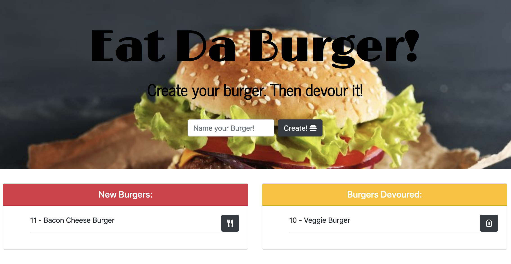

# eatDaBurger!

### About this App:

eatDaBurger is a burger app that lets users create burgers they'd like to eat.  Whenever a user submits the name of the burger s/he created, the app displays the burger on the New Burgers side of the page waiting to be devoured.  Each of the burgers created have an Eat-It button beside it.  When the user clicks on it, the burger moves to the Burgers Devoured side.  Each of the burgers on the Burgers Devoured side have a Delete-It button beside it.  When the user clicks on it, the burger is deleted.

### Packages and Technologies Used for this App:

* Bootstrap,
* Node.js,
* Express.js, 
* Express.Handlebars,
* MySql,
* Body-Parser, and
* Heroku.

### Setup the Local Environment:

To use eatDaBurger web application from your local environment,

1. Clone my repo using the command line.
2. Change the directory to the cloned repo.
3. Install all required NPM packages by typing npm install.
4. Start the application server on the command line by typing node server.js.
5. Access it locally on your browser at the URL: localhost:3000

### Thank you for visiting my github! 

Enjoy using my Heroku-deployed version here: https://fast-ridge-27781.herokuapp.com/

If you like this app, you may enjoy using more of my apps here: https://lucyq19.github.io/professionalPortfolio/